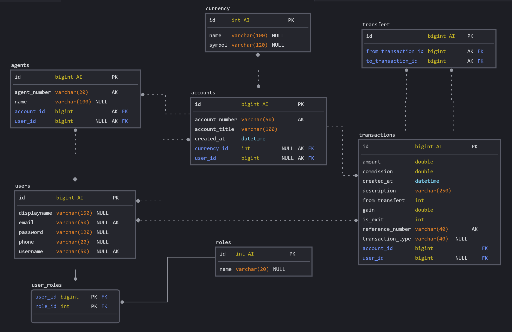
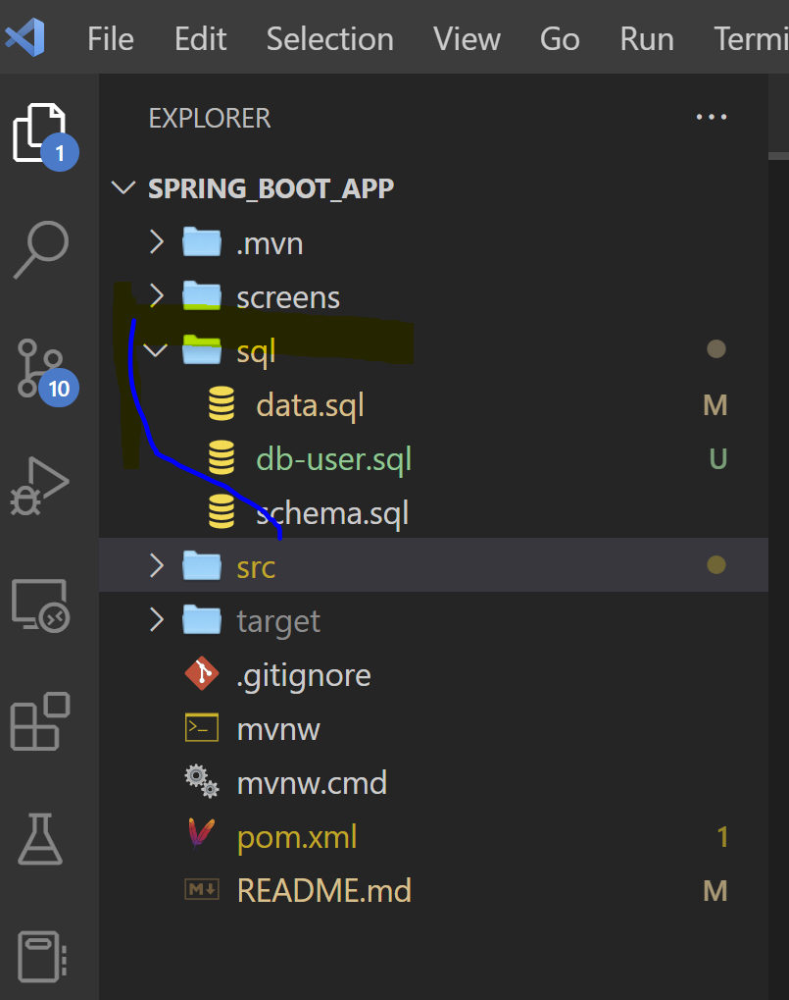
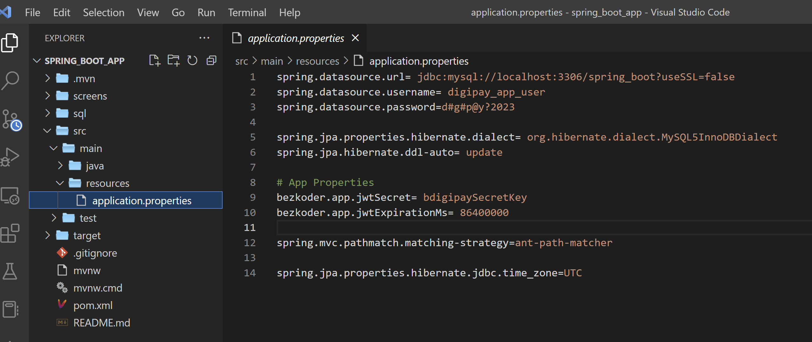

# Description du teste
<p>
Pour ce teste, j'ai créé une base de donnée d'exemple.<br/> Il faut noter que j'ai juste pris un cas très simple juste pour démontrer comment on peut créé un micro-service en utilisant le framework  <b>Spring Boot</b>.
</p>
<p>
Concernant la persistance des donnée j'ai utilisé <b>MySQL</b> comme SGBD.
</p>

<p>

Pour cet exemple, nous a la table : 
- <b>users</b> : Qui va contenir les information de tout utilisateur de l'application, je considère que tout personne aura besoin d'un compte utilisateur.

- <b>agents</b> : Cette table contiendra les infos spécifique pour les utilisateur qui auront le compte agent, juste pour nous aider à faire le retrait auprès d'un agent. Donc un agent est un utilisateur qui a un compte et un numero agent...

- <b>Roles</b> Comme tous les utilisateur nom pas le meme permission dans l'application, cette table nous permet de distinguer les utilisateurs. Vous trouverez pour certains API cette vérification...
```@PreAuthorize("hasRole('ADMIN')")```
- <b>Accounts</b> : Chaque utlisateur aura un compte banque, c'est ici qu'on va mettre ces info là.

- <b>Currency</b> : Comme nous devons avoir la possiblité de supporter plusieurs ;monnaies, chaque compte bancaire aura sa monnaie (USD, CFA ou autre) 

- <b>Transactions</b> : Pour enregistrer les opérations de retrait ou transfert d'argent, nous allons stocker ces données ici. Le montant, la date, le type de transaction, que utilisateur qui a realisé l'operation, le cout de la commission, le gain pour l'entreprise pour cette transaction.

- <b>Transfert</b> : Comme certaine opertations impliques plusieurs comptes compte, on poura avec cette table définir la provenance de l'argent..
</p>




## Creation de la base de donnees
J'ai utilisé ```Mysql 8```

Dans le dossier ```sql``` du project, vous aller trouver les script nécessaire pour créer l'utilisateur qui va nous permettre d'avoir accès à  la base de données  (```db-user.sql```), le schema (```schema.sql```), bien que JPA peut aussi le faire et enregistrer les données de test (```data.sql```)



<br/>

### Information sur accès à la base de données dans ```Spring boot```

## Installation et demarrage de l'application

```$ mvn install```

```$ mvn spring-boot:run```

<br/>

## Test des API en utilisation swagger 3
http://localhost:8080/swagger-ui/index.html

<br/>

## Autres
Il faut signaler que j'ai utilisé ce bout de code trouver sur le net, puis j'ai personnalisé.

https://github.com/bezkoder/spring-boot-spring-security-jwt-authentication.git 